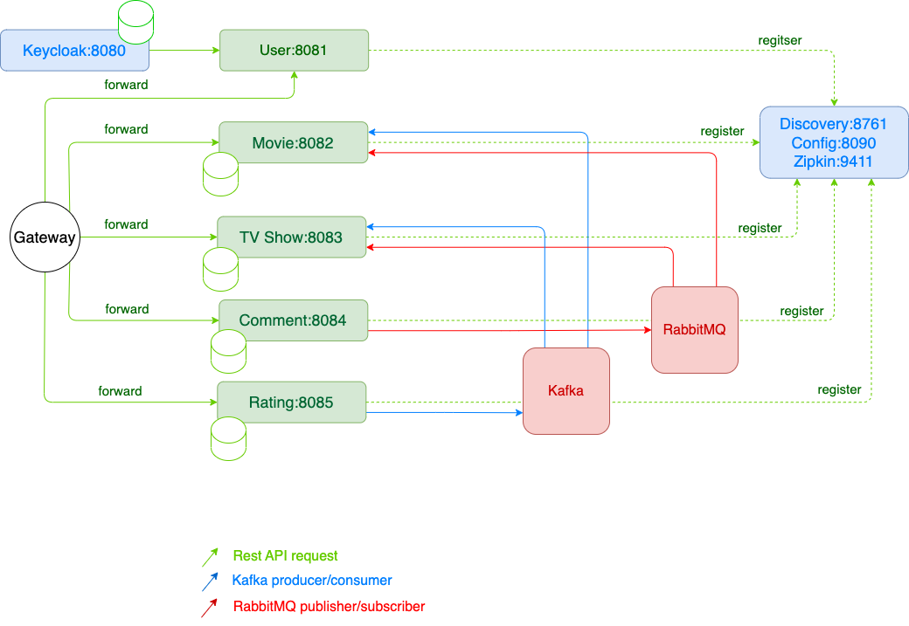

# Documentation

## Architecture image:



## Prerequisites

* Docker Desktop or Docker Environment
* Maven 3.8.3
* Java JDK 11+

## Specifications

<span style='background: rgba(255, 191, 0, 0.2); padding: 4px; border-radius: 3px'>Tested environment specs</span>

* M1 chip mac
* 4 Cpus
* 8 GB Memory
* 1 GB Swap
* loading time less than 2 minutes

## Running instruction

```shell
unset DOCKER_DEFAULT_PLATFORM # optional: if you run on m1 chip mac

sh build.sh # build jar files and build images for each service

docker-compose up -d # detachable docker run script

docker-compose down # turn down all services
```
## Services and Servers

<table>
<tr>
<th>name</th>
<th>port</th>
<th>link</th>
</tr>
<tr>
<td>gateway</td>
<td>80</td>
<td><a href='http://localhost' target='_blank'>Click here</a></td>
</tr>
<tr>
<td>keycloak server</td>
<td>8080</td>
<td><a href='http://localhost:8080' target='_blank'>Click here</a></td>
</tr>
<tr>
<td>user service</td>
<td>8081</td>
<td>NA</td>
</tr>
<tr>
<td>movie service</td>
<td>8082</td>
<td>NA</td>
</tr>
<tr>
<td>tv show service</td>
<td>8083</td>
<td>NA</td>
</tr>
<tr>
<td>comment service</td>
<td>8084</td>
<td>NA</td>
</tr>
<tr>
<td>rating service</td>
<td>8085</td>
<td>NA</td>
</tr>
<tr>
<td>kafka ui</td>
<td>8089</td>
<td><a href='http://localhost:8089' target='_blank'>Click here</a></td>
</tr>
<tr>
<td>config server</td>
<td>8090</td>
<td>
<div>User service config &rarr; <a href='http://localhost:8090/user-service/default' target='_blank'>Click here</a></div>
<div>Movie service config &rarr; <a href='http://localhost:8090/movie-service/default' target='_blank'>Click here</a></div>
<div>TV Show service config &rarr; <a href='http://localhost:8090/tvshow-service/default' target='_blank'>Click here</a></div>
<div>Rating service config &rarr; <a href='http://localhost:8090/rating-service/default' target='_blank'>Click here</a></div>
<div>Comment service config &rarr; <a href='http://localhost:8090/comment-service/default' target='_blank'>Click here</a></td></div>
</tr>
<tr>
<td>registry server</td>
<td>8761</td>
<td><a href='http://localhost:8761' target='_blank'>Click here</a></td>
</tr>
<tr>
<td>zipkin</td>
<td>9411</td>
<td><a href='http://localhost:9411' target='_blank'>Click here</a></td>
</tr>
<tr>
<td>rabbitmq ui</td>
<td>5673</td>
<td><a href='http://localhost:5673' target='_blank'>Click here</a></td>
</tr>
</table>

## Users

<table>
<tr>
<th colspan="2">System Users</th>
</tr>
<tr>
<th>username</th>
<th>password</th>
</tr>
<tr>
<td>user1</td>
<td>user1</td>
</tr>
<tr>
<td>user2</td>
<td>user2</td>
</tr>
<tr>
<td>user3</td>
<td>user3</td>
</tr>
<tr>
<td>owner1</td>
<td>owner1</td>
</tr>
<tr>
<td>owner2</td>
<td>owner2</td>
</tr>
<tr>
<td>owner3</td>
<td>owner3</td>
</tr>
</table>

<table>
<tr>
<th colspan="2">RabbitMQ</th>
</tr>
<tr>
<th>username</th>
<th>password</th>
</tr>
<tr>
<td>guest</td>
<td>guest</td>
</tr>
</table>

<table>
<tr>
<th colspan="2">Keycloak Admin</th>
</tr>
<tr>
<th>username</th>
<th>password</th>
</tr>
<tr>
<td>admin</td>
<td>Pa55w0rd</td>
</tr>
</table>


# Troubleshootings

## AMD64 architecture type

If you are running docker-compose script on macbook pro that has m1 chip and set docker default platform to linux/amd64 it will take some time to load everything. Instead, unset default platform value and run docker-compose script to get the best result.

```shell
!don't set DOCKER_DEFAULT_PLATFORM=linux/amd64 # on M1 Macs will takes 10 minutes to run every service
```

# Requirements

## Movie Rating Portal
 
In this project, you will develop a clone of IMDB website. To get a better understanding of the project, check out imdb.com.

In this application, users can create, rate and write comments about movies and tv series. Users can create favorite lists and they can share their lists with other users.

There will be 5 main resource servers:
 - ✅ Movie Service
	 - ✅ CRUD operations for movies.
 - ✅ Tv Series Service
	 - ✅ CRUD operations for tv series.
 - ✅ Comment Service
	 - ✅ CRUD operations for comments.
	 - ✅ Users can write comment for movies and/or tv series.
 - ✅ User Service
	 - ✅ CRUD operations for users.
	 - ✅ Login and Register functionality.
 - ✅ Rating Service 
	 - ✅ CRUD operations for ratings.

Your project must have
- ✅ Discovery Server
- ✅ API Gateway
- ✅ Configuration Server
- ✅ OAuth 2 Server (Keycloak)
- ✅ Tracing (Zipkin and Sleuth)
- Vault 


####  Functional  Requirements
--- 
* ✅ Users can register to the system.
* ✅ Owners can create/remove/update movies and tv series.
* ✅ User can filter movies or tv series by :
    * ✅ released year,
    * ✅ rating,
    * ✅ genre,
    * ✅ director,
    * ✅ actor/actress
    * ✅ duration.
* ✅ Users can create/remove/update comments for movies/tv series
* ✅ Users can rate movies/tv series.
	* ✅ Rating is between 1 and 5.
* ✅ Users can add/remove movies/tv series to/from their favorite lists.
	* ✅ Users can have multiple favorite lists.

#### Technical Details
---
* ✅ Use inheritance for tv series and movies. 
* ✅ Use appropriate hibernate fetch strategies.
* Use ✅ RabbitMQ and ✅ Kafka.
* ✅ Each microservice must contain a Dockerfile to create a docker image.
* ✅ Implement Eventual Consistency.
* ✅ Each service must have `data.sql` for dummy data.
* ✅ Have 1 Kubernetes Deployment Configuration file.
* ✅ Create a Postman collection for each endpoint.
* ⛔️ Create API documentation with Swagger.
* ✅ Prepare a docker compose file to run your project.
* ✅ Use Circuit Breaker pattern for 5 methods.
* ⛔️️ Use ELK Stack to store your application logs.
    * Please refer to https://www.elastic.co/what-is/elk-stack


#### Submission
---
* Upload your source code and project documentation to the Sakai.
* Every member should submit the project to the Sakai.
* Deadline: Sunday Nov 27th at 11:55 PM.
* Project will be evaluated based on your code quality. It is possible that I will need to schedule meetings with students about their source-code.

#### Important Notes
---
* You are not allowed to share codes with your classmates. If detected, you will get NC.
* Remember to respect the code honor submission policy. All written code must be original. Presenting something as one’s own work when it came from another source is plagiarism and is forbidden.
* Plagiarism is a very serious thing in all American academic institutions and is guarded against vigilantly by every professor.
 
